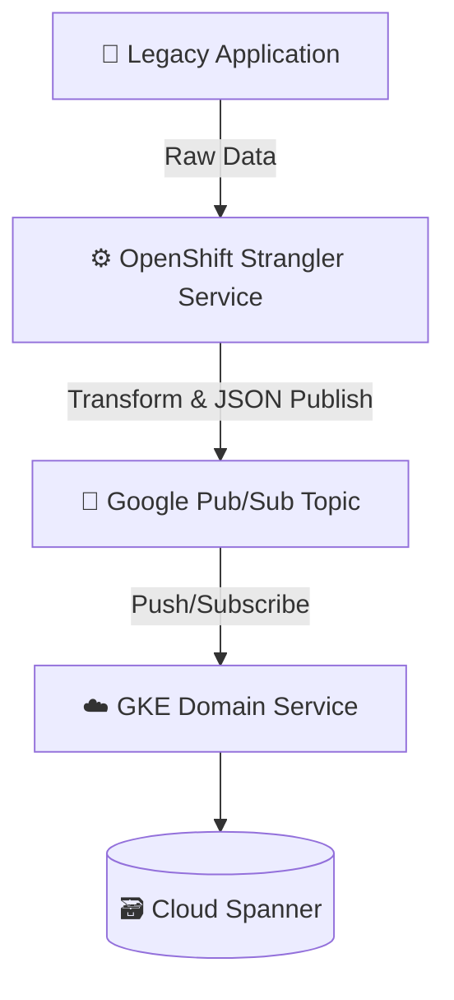

# 🧬 Pattern: Legacy-to-Cloud Messaging Pipeline

## 📌 Description

A legacy application emits structured or semi-structured data. An OpenShift-based **Strangler Service** reads this data, transforms it into a JSON payload, and publishes it to a **Google Pub/Sub** topic. A cloud-native **Domain Service** running in **GKE** subscribes to this topic, processes the message, and persists the result in **Cloud Spanner**.

This enables incremental modernization without disrupting the legacy application.

---

## ✅ Use Cases

- Gradual strangler migration away from legacy systems
- Decoupling legacy data flows from modern processing logic
- Providing cloud-native services access to mainframe or COBOL-origin data

---

## 🧩 Components

- **Legacy Application** – Source of raw data (file, message queue, etc.)
- **Strangler Service (OpenShift)** – Reads, transforms, publishes
- **Pub/Sub** – Durable cloud-native messaging backbone
- **GKE Domain Service** – Subscribes and applies business logic
- **Cloud Spanner** – Scalable and transactional persistence layer

---

## 🧭 Mermaid Diagram

---

## 🧠 Cleo's Notes

- Always **enrich messages with metadata** (e.g., source timestamp, trace ID)
- Consider **dead-letter topics** for failures in transformation or validation
- Secure all message paths with IAM and scoped service accounts
- Use Spanner **interleaved tables or change streams** if modeling hierarchical data

---

📂 Add this diagram to: `diagrams/legacy_to_cloud_flow.mmd`  
📝 Linked from the main README and checklist
