# 🧬 Pattern: Scheduled DB2 Reader to ActiveMQ for Legacy Integration

## 📌 Description

An OpenShift-hosted **scheduler service**, triggered via Quartz, reads records from a **DB2 database** on a scheduled interval. Each record is transformed into a legacy-compatible format and published to an **ActiveMQ** queue. The legacy system consumes this message for downstream processing.

---

## ✅ Use Cases

- Periodic publishing of legacy-bound records from a modern microservice
- Offloading cron-like processing into OpenShift Quartz-managed jobs
- Bridging modern scheduling logic with legacy JMS systems

---

## 🧩 Components

- **Quartz Scheduler** – Triggers the job based on CRON or time-based rules
- **OpenShift Scheduler Service** – Reads and processes records
- **DB2** – Source of records (typically batch-based)
- **Message Formatter** – Prepares message for legacy consumption
- **ActiveMQ** – Delivery system for downstream processing
- **Legacy System** – The end consumer

---

## 🧭 Mermaid Diagram

```mermaid
graph TD
    Quartz[🕰️ Quartz Scheduler] --> SchedulerService[⚙️ OpenShift Scheduler Service]
    SchedulerService --> DB2[(🧮 DB2 Table)]
    SchedulerService -->|Transform & Format| Message[🧠 Message Builder]
    Message --> ActiveMQ[📬 ActiveMQ Queue]
    ActiveMQ --> LegacySystem[🧓 Legacy Consumer System]
```

---

## 🧠 Cleo’s Notes

- Include retry logic and backoff in DB2 and ActiveMQ connections
- Support idempotency to prevent double-publishing
- ActiveMQ message formats may be XML or legacy-JSON—schema validation is essential
- Job history and last successful run timestamp should be tracked
- Consider DLQ (dead-letter queue) for unprocessable records
