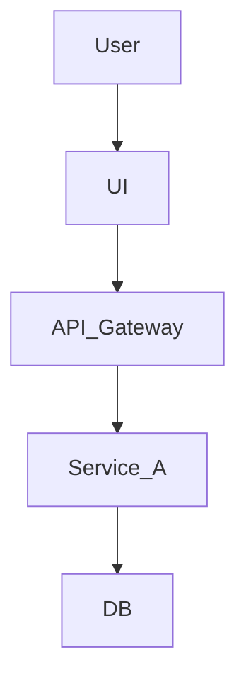

# 🏗️ Full Architecture Review Template

## 📜 1. Overview

**Service / System Name**:  
**Reviewed By**:  
**Date**:  
**Stakeholders**:  
- Product Owner:  
- Tech Lead:  
- Security Lead:  
- Operations Contact:  

---

## 🎯 2. Problem Statement

_What are we solving, and why now?_  
Clearly define the core business or technical problem that this architecture is intended to address.

---

## 🎯 3. Goals and Non-Goals

**Goals (Must Haves):**
- Bullet list of explicit requirements

**Non-Goals (Out of Scope):**
- Things people *might* assume are included but aren’t

---

## 🌐 4. Context & Background

_What is the current landscape?_  
Explain the environment this system is part of. Link to previous systems, legacy constraints, or related services.

Include a **high-level diagram** if possible.

# 🧠 5. Architectural Design
**Key Components:**
- Service list (e.g., API Gateway, Backend, DB)
- Patterns used (e.g., Event Sourcing, CQRS)

**Data Flow Summary:**
- Describe the general flow (e.g., Request to Auth to Process to Persist to Notify)

**Technology Choices and Justification:**
- Why were these languages, frameworks, or cloud tools chosen?

# ⚖️ 6. Tradeoffs and Risks
**Decisions that involved tradeoffs:** 
- e.g., Chose NoSQL for speed, but gave up on relational constraints

**Known Risks:**
- e.g., Scaling bottleneck under high write loads
- e.g., Vendor lock-in concerns

# 🔐 7. Security and Compliance
- Authentication method (OIDC, JWT, etc.)
- Authorization model (RBAC, ABAC, etc.)
- Data encryption (in-transit, at-rest)
- Secrets management
- PII / compliance handling

# 🔎 8. Observability
- Logging strategy
- Metrics collection (Prometheus? GCP Monitoring?)
- Tracing setup (OpenTelemetry? Jaeger?)
- Dashboards and alerting

# ☁️ 9. Scalability & Resilience
- Stateless or stateful?
- Horizontal vs vertical scaling plans
- Circuit breakers / retries?
- DR & backup strategy

# 🔧 10. Operational Considerations
- Deployment strategy (Blue/Green, Canary, Rolling?)
- IaC used (Terraform, Pulumi, etc.)/
- On-call rotation owner
- SLOs / SLIs

# ❓ 11. Open Questions
- List anything unresolved that needs input before sign-off.

# 📌 12. Appendices
- Mermaid diagrams
- Links to tickets, docs, and designs